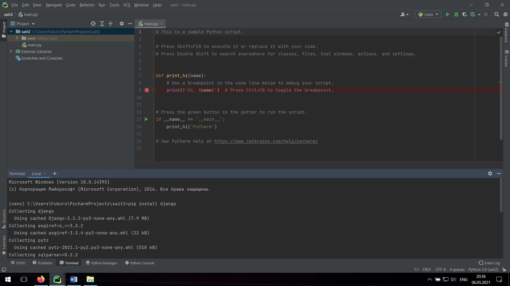
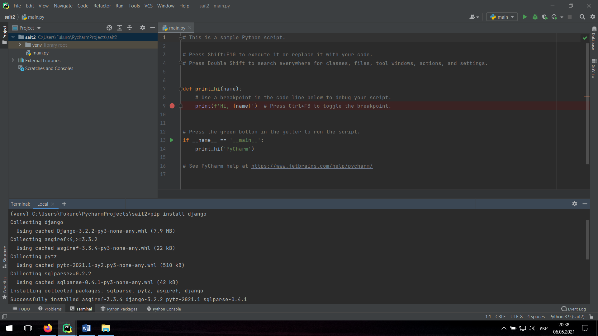
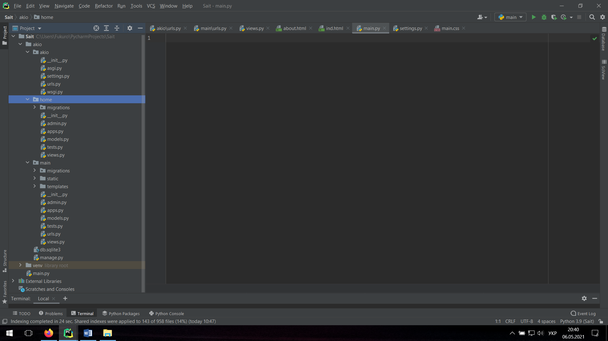
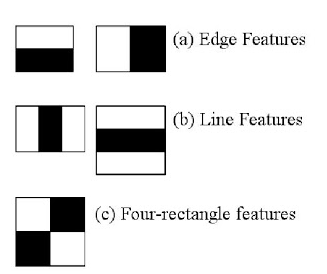
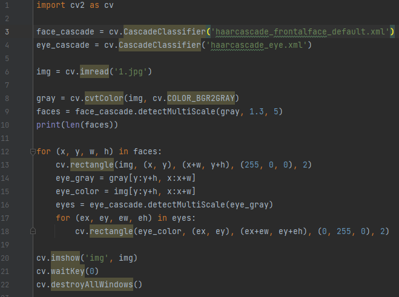
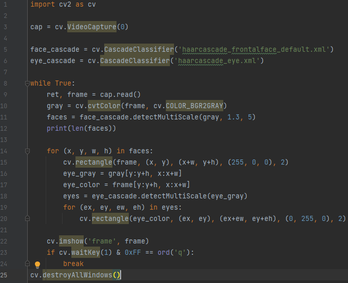
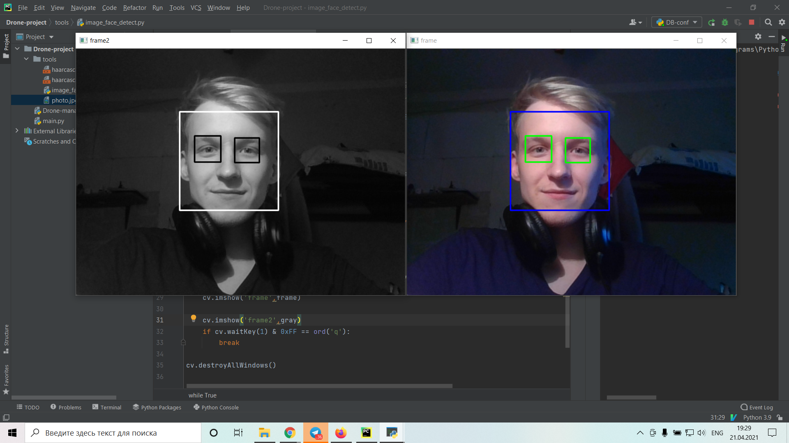
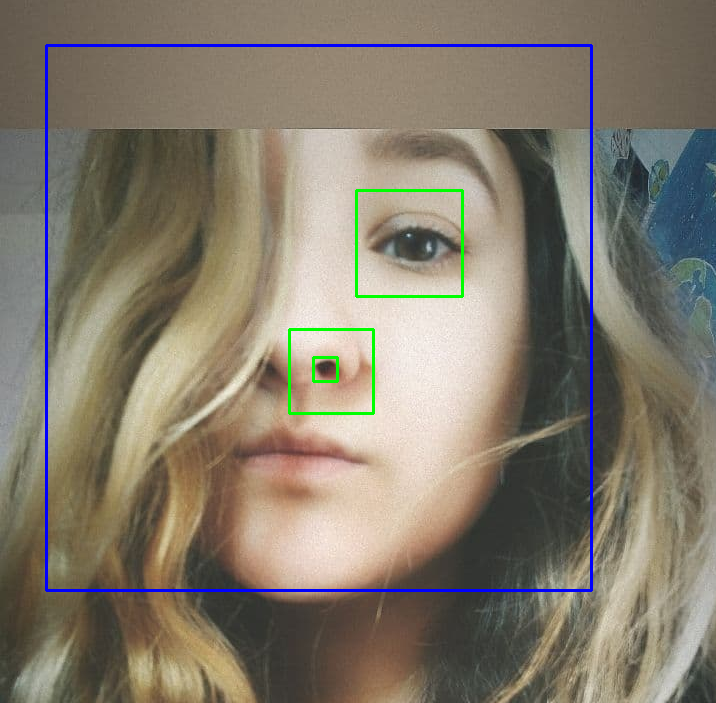

## РГР
Мета роботи: встановлення Python на ПК, написання свого сайту та алгоритму розпізнання обличчя по фото та відео. 

Основною метою розрахункової роботи було встановлення мови програмування python (через «cmd» або за допомогою «.exe» з офіційного сайту). 

Наступним кроком було встановлення «PyCharm» одна з успішніших середовищ програмування на мові «Python». Далі ми створюємо проект в «PyCharm»:

Необхідно встановити компоненти для написання сайту (Django):

Код який включає основі компоненти головної сторінки:


<!doctype html>
<html lang="en">
<head>
`    `<meta charset="UTF-8">
`    `<meta name="viewport"
`          `content="width=device-width, user-scalable=no, initial-scale=1.0, maximum-scale=1.0, minimum-scale=1.0">
`    `<meta http-equiv="X-UA-Compatible" content="ie=edge">
`    `<title>Главная страница</title>
`    `<link rel="stylesheet" href="https://cdn.jsdelivr.net/npm/bootstrap@4.6.0/dist/css/bootstrap.min.css">
`    `<link rel="stylesheet" href="">
`    `<link rel="stylesheet" href="https://use.fontawesome.com/releases/v5.8.2/css/all.css">
</head>
<body>
`    `<aside>
`        `
`        `ITS
`        `<h3>Дрон</h3>
`        `<ul>
`            `<a href=""><li><i class="fas fa-home"></i> Главная</li></a>
`            `<a href=""><li><i class="fas fa-address-card"></i> Про нас</li></a>
`            `<a href=""><li><i class="fas fa-paper-plane"></i> Контакты</li></a>
`        `</ul>
`    `</aside>
`    `<main>
`        `<h1>Главная страница</h1>
`    `
Главная страница

`    `</main>

</body>
</html>

Та ще багато компонентів, таких як завантаження зображення, інтерфейс переходу та ще багато делікатних налаштувань.

Отриманий сайт:

Так ми створили сайт для майбутнього дипломного проекту. В ньому буде відображатись потокове відео з дрону. Він буде керуватись з програми на комп’ютері або мобільному телефоні за допомогою штучного інтелекту, алгоритму розпізнання обличчя. 

Для досягнення мети ми познайомились з основами розпізнавання осіб і очей за допомогою каскадних класифікаторів на основі функцій Хаара.

Можна також використовувати попередньо визначені Каскади Haar, які доступні у відкритому доступі. 

Виявлення об'єктів з використанням каскадних класифікаторів Хаара - це підхід, заснований на машинному навчанні. Каскадна функція будується на великій кількості позитивних і негативних зображень. А потім використовується для виявлення об'єктів на зображеннях.

Для початку алгоритму потрібно багато позитивних зображень (зображень обличь) та негативних зображень (зображень без обличь) для навчання класифікатора. Потім нам потрібно витягнути з нього функції. Для цього використовуються особливості Хаара, показані на зображенні нижче.. Кожна функція представляє собою окреме значення, отримане шляхом віднімання сум  пікселів під білим прямокутником з сум пікселів під чорним прямокутником.

Особливості ф.Хаара: 

Як ви можете побачити на малюнку, перші два - це "крайові функції", які використовуються для виявлення країв зображення. 

Третій - це "лінійна функція" (горизонтальна та вертикальна).  Горизонтальна пояснюється тим, що область очей значно темніше, ніж область носа або щоки. А вертикальна - що очі темніше за перенісся.

А четверта - "чотири прямокутника", найчастіше використовується для виявлення похилої лінії.

Для перевірки, ми застосували такий код:

З допомогою ного ми можемо знаходити з ШІ обличчя та очі на фото (рис.1)  та відео (рис.2) 

Рис. 1 – Для фото

Рис. 2 – Для відео

Результати: 

З відкритим лицем:

Також з перешкодами\завадами для розпізнання лиця

# Висновки: 

У ході виконання розрахунково-графічної роботи було встановлено Python та  PyCharm, написано простий сайт на мові програмування Python
для майбутньої його реалізації. Також були розглянуті алгоритми виявлення об'єктів з використанням каскадних класифікаторів Хаара, показані приклади знаходження обличчя та очей. 
